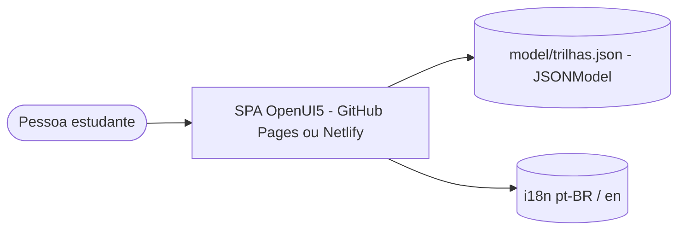
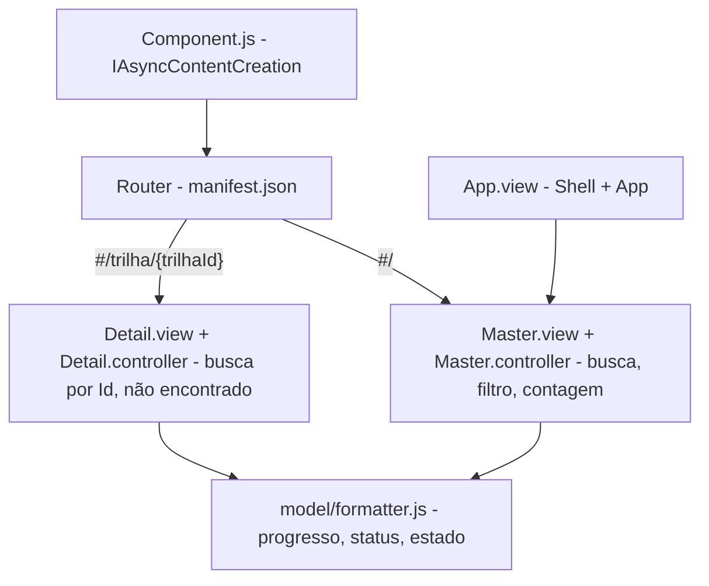

# Arquitetura — Learning Portal Fiori SAP

## C4 — Contexto e contêiner

## C4 — Componentes

## ADRs

| # | Decisão | Motivo | Alternativa |
|---|---|---|---|
| ADR-01 | Manter OpenUI5 (decisão sua) | Projeto é laboratório de SAPUI5/Fiori | Migrar para React |
| ADR-02 | Progresso e status derivados, nunca gravados | Fonte única: `Concluidos` e `ModulosCount` | Manter campos no JSON |
| ADR-03 | Router do UI5 com hash | Funciona em hospedagem estática sem reescrita | Diálogo (original) |
| ADR-04 | UI5 local via `ui5.yaml` (framework OpenUI5 1.136) | Sem dependência de CDN; build self-contained | Bootstrap do CDN |
| ADR-05 | Smoke com Playwright em vez de OPA5 | Roda headless no CI sem Karma | OPA5 + Karma (próximo ciclo) |
